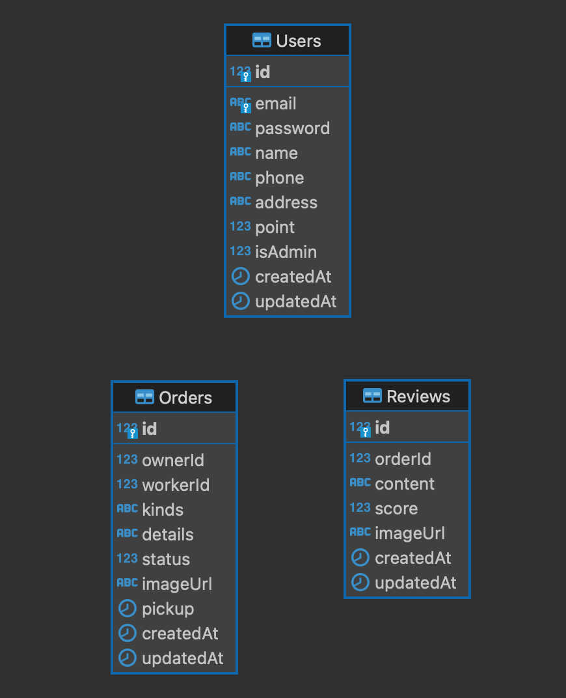

# 키보드를구해조!

<br>

키보드 윤활 서비스 매칭 플랫폼

<br>
<br>

## 📌 목차 

- [시연 영상](#-시연-영상)
- [기술스택](#%EF%B8%8F-기술스택)
- [프로젝트 구조](#-프로젝트-구조)
- [설계](#-설계)
- [팀원 소개](#-팀원-소개)

<br>
<br>

## 🎥 시연 영상

> 아래 이미지를 클릭하면 시연 영상을 시청할 수 있습니다.

[](https://youtu.be/5fWCufVN4S4)

<br>
<br>

## ⚙️ 기술스택

<div>
  <!-- Express -->
  
  <!-- Node.js -->
  
  <!-- Sequelize -->
  
  <!-- Socket.io -->
  
</div>

<div>
  <!-- MySQL -->
  
  <!-- Redis -->
  
  <!-- GitHub -->
  
</div>

<br>
<br>

## 🗂 프로젝트 구조

<details>
  <summary><b>Express + ejs</b></summary>

```html
📦src
 ┣ 📂controllers
 ┣ 📂middlewares
 ┣ 📂public
 ┃ ┣ 📂css
 ┃ ┣ 📂images
 ┃ ┣ 📂js
 ┃ ┗ 📂uploads                      # 업로드 이미지 폴더
 ┣ 📂repositories
 ┣ 📂routes
 ┣ 📂sequelize
 ┣ 📂services
 ┣ 📂utils
 ┃ ┣ 📜PaginationManager.js         # 페이지네이션 관리 유틸
 ┃ ┣ 📜SocketManager.js             # socket.io 모듈화 파일
 ┃ ┣ 📜TokenManager.js              # 토큰 관리 유틸
 ┃ ┣ 📜UploadManager.js             # multer를 통한 이미지 업로드 관리 유틸
 ┃ ┗ 📜redis.util.js                # redis 관리 유틸
 ┗ 📂views
   ┣ 📂components                   # nav, alert 등 공통 컴포넌트
   ┣ 📂orders                       # 윤활 요청 관련
   ┣ 📂reviews                      # 리뷰 관련
   ┣ 📂users                        # 유저 관련
   ┗ 📜index.ejs
```
</details>

<br>
<br>

## 🛠 설계

<details>
  <summary><b>ERD</b></summary>
  <div markdown="1">
    <ul>
      <div></div>
    </ul>
  </div>
</details>

<details>
  <summary><b>API</b></summary>
  <div markdown="1">
    <ul><li>이미지로 올리기엔 너무 긴 관계로 링크로 대체하였습니다.</li></ul>
    <ul>
      <a href="https://husky-mink-239.notion.site/0764f0356a6f4b70a3dc9adec1559012?v=3098a397260848c9a072cc5a5a56604e" target="_blank" style="font-size: 25px;">[Notion 링크] API 보러가기</a>
    </ul>
  </div>
</details>

[▶️ 기획안](https://husky-mink-239.notion.site/73d9aef0409c43e98b60e2ac545adcfb)   
[▶️ 회고록](https://4sii.tistory.com/310)

<br>
<br>

## 👨‍👨‍👧‍👦 팀원 소개

|  |  |
| :-: | :-: |
| 조성훈 | 조해빈 |
| [GitHub](https://github.com/cchoseonghun), [블로그](https://4sii.tistory.com) | [GitHub](https://github.com/haebeenjo) |
| cchoseonghun@gmail.com | haebeenjo@gmail.com |
